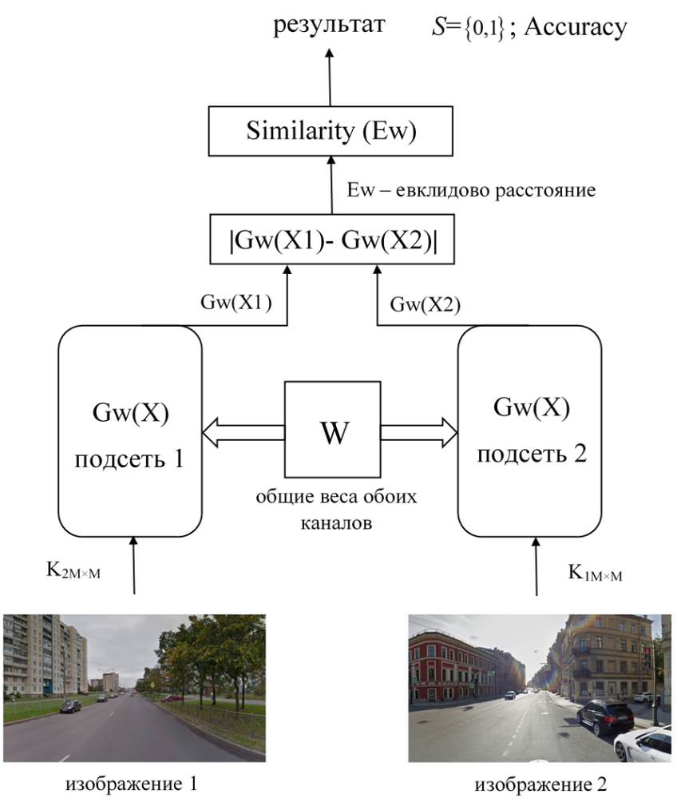

<h1 style="text-align: center;">Siamese Neural Net (Eagle-Eye)</h1> 
<h2 style="text-align: center;">Описание задачи</h2>

 Вследствие некорректной работы спутниковых навигационных систем возникает вопрос разработки альтернативных систем навигации, например, систем визуальной навигации. В данном проекте необходимо сравнивать данные автомобильного видеорегистратора, которыми располагает пользователь, с изображениями панорамам Street View (с заранее известными координатами)  и, в случае совпадения двух изображений, определять координаты местоположения пользователя.

  <h2 style="text-align: center;">Технологический стек </h2> 

* Система: Ubuntu 22.04
* Инструменты контейнеризации: Docker
* Системы управления зависимостями: conda, pip
* Язык программирования: Python 3.10.12
* Глубокое обучение: PyTorch (2.6.0+cu124)
* Работа с данными: Transformers, TorchVision, OpenCV, NumPy, SciPy, timm

 <h2 style="text-align: center;">Метод решения задачи </h2> 
 
Для получения высокой точности сопоставления изображения из видеопотока регистратора или обычной камеры с 3D-панорамами местности использована сиамская нейронная сеть, эффективная для задач, основанных на определении сходства между парами входных данных. 
 
 * ***Принцип работы сиамской сети*** 

 Сиамская сеть представляет собой две одинаковые сети, по структуре аналогичные сверточным , соединенные параллельно и имеющие общую матрицу весов  W.  Отличием от сверточных сетей является замена выходного слоя классификации на компаратор, сравнивающий выходы параллельных сетей по метрикам расстояния.

 Признаки изображений по каждому из каналов, выделенные в ходе обучения сети, на выходе алгоритма поступают на компаратор для измерения расстояния между ними и принятия решения об отнесении пары изображений классу 0 или 1 (0 отвечает за класс непохожих изображений, 1 – похожих). Существует множество различных метрических методов классификации объектов, основанных на расстояниях (мере близости) конкретного образа до образов других классов в признаковом пространстве. В решении данной задачи метрическим методом является евклидово расстояние.

 

 
 

 * ***Выбранная архитектура сети*** 
 

 
 

 * ***Функция потерь*** 

Обучающая выборка состоит из множества положительных пар изображений   и множества отрицательных пар  , где y1, y2 – метки. Функция потерь позволяет определять сходство входных данных путём сравнения их векторов признаков. Она имеет цель минимизировать евклидово расстояние между данными одного класса и увеличить между данными разных классов. Функция потерь имеет вид:

	

где hi,j – выходы сетей, образующих сиамскую сеть;
 beta – степень различия евклидовых расстояний.
y – метки классов (y=1, изображения похожи, пара «хорошая», y=0, изображения не похожи, пара «плохая»)
Поступающие в момент t на параллельные входы обученной сети векторы   преобразуются во внутреннее представление сети  (k=1,2):

где   – функция активации; b – смещение.
На выходе каждой из параллельных ветвей формируется вектор  . 

Для получения окончательного ответа о совпадении или расхождении входных сигналов нейронной сети анализируется евклидово расстояние между выходами каждой из параллельных подсетей. На выходе сети формируется бинарная величина S= , где 0 означает, что изображения не совпадают, а 1 соответствует случаю, когда на вход сети поступают совпадающие изображения.

<h2 style="text-align: center;">Подготовка данных  </h2>
Было сформировано 500 похожих и 500 непохожих пар изображений для обучения сиамской нейросети. Первоначально на видеорегистратор  AdvoCam-W101 был заснят автомобильный маршрут «Привокзальная площадь – Тверской мост – ул. Тверская, 37» (Колпино, Санкт-Петербург) и на видеорегистратор Xiaomi 70Mai А800 - маршрут «8-я Советская ул., 53 – ул. Некрасова – Лиговский проспект – наб. Обводного канала – Днепропетровская ул. – наб. реки Волковки, 3» (Санкт-Петербург). С помощью онлайн-сервиса Batchtools.pro записи видеорегистраторов были преобразованы в множество кадров (.jpg) с периодичностью 0.5 секунд. 

Затем были скачаны 3D-панорамы точек описанных маршрутов с помощью ПО Street View Download 360 для Google maps. Так как сохраняемая панорама имеет развернутый вид в 360° (Рис.5а), необходимо оставить только «середину» изображения, редуцируя боковые стороны на ~ 3.5 доли ширины, а нижнюю и верхнюю на ~ 3.17 доли высоты, чтобы сохранялось соотношение сторон 16:9, как у кадров видеопотока.

С целью экономии памяти, изображения, подающиеся на вход сети для обучения, были приведены к одному разрешению 640*640.

 Необходимые данные для обучения и тестирования можно скачать по ссылкам: 
 * Базовые изображения улиц (**base**): https://drive.google.com/drive/folders/17kdmoCpFi_8ucnViubnFA4C12cfdQumJ?usp=sharing
 * Изображения, непохожие на базовые (**opposite**):  https://drive.google.com/drive/folders/1u4v40OkZfNZfDaLoqxvfBVW2K0gpDc49?usp=sharing
 * Изображения, похожие на базовые (**common**): https://drive.google.com/drive/folders/17M-Bju1NvurZ_fVRV1JdukxUAaRdwIV0?usp=sharing

<h2 style="text-align: center;">Результаты</h2>

Обучение производилось в течение **15** эпох, значение метрики **accuracy = 0.99**, **loss = 0.0275**.

 

 
 

 

 
 

 <h2 style="text-align: center;">Достижения</h2>
 

 
 

<h2 style="text-align: center;">Масштабирование системы </h2>
 
 * Увеличение объема обучающих данных
 * Использование предобученных сетей, использующих принцип сопоставления контрольных точек (например, OmniGlue)

